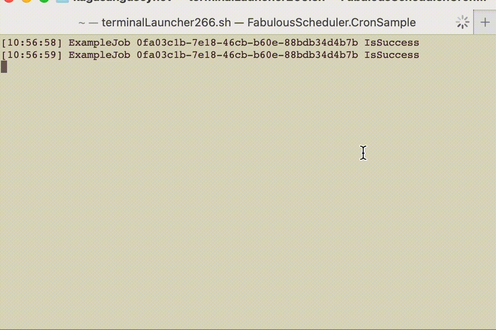

<div align="center">
 
<h2 align="center">✨High performance cron & queue scheduler✨</h2>
<h3 align="center">Please leave a ⭐ as motivation if you liked the lib 😄
<br>🌪️Currently a WIP and in Active development.</h3>


[)](https://www.nuget.org/packages/FabulousScheduler)
[)](https://www.nuget.org/packages/FabulousScheduler)
[)](https://github.com/lif0/FabulousScheduler/blob/main/LICENSE)

<h>If you have feature request feel free to open an [Issue](https://github.com/lif0/FabulousScheduler/issues/new/choose)</h4>
</div>
<br />

## 📖 Contents

- [Motivation](#motivation)
- [Purpose](#purpose)
- [Features](#features)
- [Usage](#usage)
    - [Requirements](#requirements)
    - [Installation](#installation)
    - [QuickStart](#examples)
- [Benchmarks](#benchmarks) (future)
    - [Performance](#performance) (future)
- [License](#LICENSE)


## 💡 Motivation <a id="motivation" />

One day I came across the fact that none of a libraries can perform many tasks in parallel, while doing it on time and non-stop. I needed to grab html pages with prices for certain products from sites such as ebay, amazon, walmart, to track the best deals for certain products and send a notification with a link to these products to my client.

## 🫵 Who is this library for <a id="purpose" /> 
I have developed this library for cases where you need to launch a large count of tasks without stopping. When you need to do a lot of IO-bound in parallel. I used this library where I had to grab the site pages at the same time once a minute and it proved to be stable.
<br> In which projects it will be perform best❓<br>
- If you need to grab a site pages without stopping <br>
- If you need to get price quotes from exchanges for a large count of shares by API
- And in many other projects where you have to do something on time, in large quantities and with a certain frequency

## 🚀 Features <a id="features" />
- [x] Default cron scheduler
- [ ] Default queue scheduler
- [ ] Docs for CustomCronJobManager
- [ ] Docs for CustomQueueJobManager
- [ ] Benchmark for JobResult type
- [x] Return job result via pub/sub callback event
- [ ] Cover all project with unit tests
- [ ] A structure for store jobs. take: O(1) push: (?) 

## 📚 Usage <a id="usage" />
### 📋 Requirements <a id="requirements" />

- dotnet 6.0+

### 🛠️ Installation <a id="installation" />

```shell
dotnet add package FabulousScheduler
```

### ✏️ QuickStart <a id="examples" />

****
**Main idea**

Every Job return the type <b>JobResult<<i>IJobOk</i>, <i>IJobFail</i>></b> if a job complete with success will be return an instance of <b><i>IJobOk</i></b> else <b><i>IJobFail</i></b>. I decided that an exception should not be throw, if an exception occurs, it will be put in <b><i>IJobFail</i></b>.<i>Exception</i>.

**Result matching**

```csharp
    JobResult<Cron.JobOk, Cron.JobFail> result;
    
    // Do action
    result.Do(
        success: (ok) => Console.WriteLine("{0} is success", ok.JobID),
        failure: (fail) => Console.WriteLine("{0} is failure. Msg:{1}", fail.JobID, fail.Message)
    );
    
    // or matching
    var msg = result.Match<string>(
        success: ok => string.Format("{0} is success", ok.JobID),
        failure: fail => string.Format("{0} is failure. Msg:{1}", fail.JobID, fail.Message)
    );
    Console.WriteLine(msg);
```

FabulousScheduler uses a builder pattern that allows you to conveniently create a cron or queue jobs for executing.
<br>
1. SetConfig()
2. Register jobs
3. RunScheduler()

```csharp
using FabulousScheduler.Cron.Interfaces;
using FabulousScheduler.Cron.Result;
using FabulousScheduler.Core.Types;
using FabulousScheduler.Cron;


var config = new Config(
    maxParallelJobExecute: 5,
    sleepAfterCheck: TimeSpan.FromMilliseconds(100)
);
CronJobManager.SetConfig(config);

// Register callback for job's result
CronJobManager.JobResultEvent += (ref ICronJob job, ref JobResult<JobOk, JobFail> res) =>
{
    var now = DateTime.Now;
    if (res.IsSuccess)
        Console.WriteLine("[{0:hh:mm:ss}] {1} {2}", now, job.Name, res.JobID);
    else
        Console.WriteLine("[{0:hh:mm:ss}] {1} {2}", now, job.Name, res.JobID);
};

// Register a job
CronJobManager.Register(
    action: () =>
    {
        //do some work
        int a = 10;
        int b = 100;
        int c = a + b;
    },
    sleepDuration: TimeSpan.FromSeconds(1),
    name: "ExampleJob"
);

// Start a job scheduler
CronJobManager.RunScheduler();

/*
 * The job will fall asleep for 1 second after success completion, then it will wake up and will be push the job pool
*/

Thread.Sleep(-1);
```



## 📄 LICENSE <a id="LICENSE" />
### GPL3 LICENSE SYNOPSIS

**_TL;DR_*** Here's what the GPL3 license entails:

```markdown
1. Anyone can copy, modify and distribute this software.
2. You have to include the license and copyright notice with each and every distribution.
3. You can use this software privately.
4. You can use this software for commercial purposes.
5. Source code MUST be made available when the software is distributed.
6. Any modifications of this code base MUST be distributed with the same license, GPLv3.
7. This software is provided without warranty.
8. The software author or license can not be held liable for any damages inflicted by the software.
```

More information on about the [LICENSE can be found here](http://choosealicense.com/licenses/gpl-3.0/)
